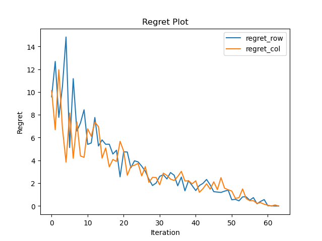
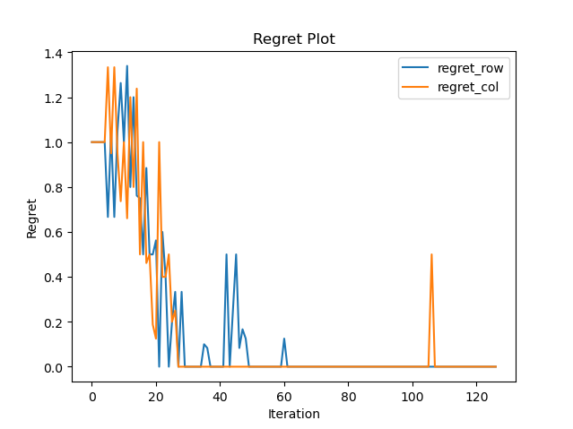
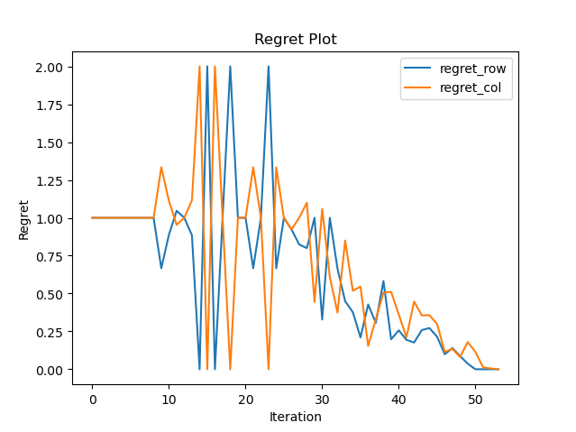

# Simple Double Oracle

To run the double oracle algorithm:

```
usage: main.py [-h] [-r ROWS] [-c COLS]

optional arguments:
  -h, --help            Show this help message and exit
  -r ROWS, --rows ROWS  The rows of the random game matrix
  -c COLS, --cols COLS  The columns of the random game matrix
  -g, --gambit          Use Gambit to solve LP or Nashpy
  -m, --games           Select a game to play (5,5-Blotto, tic_tac_toe ...)
```

To choose games other than at random, you should download the [payoff](https://proceedings.neurips.cc/paper/2020/hash/ca172e964907a97d5ebd876bfdd4adbd-Abstract.html) from this link and save it in the folder named 'games'.

The double oracle algorithm works as follows:

>***Double Oracle Algorithm***
>1. Let $\Pi^0 = \{\Pi^0_1, \Pi^0_2\}$ be the initial population of strategies for each player $i=1,2$
>2. **Repeat** at each iteration $t$
>    1. Compute the NE $\pi^t$ of the game restricted to the strategies in $\Pi^t$
>    2. For each player $i$, find a best response $\beta_i \leftarrow \mathbb{BR}_ i(\pi^t_{-i})$ using an oracle that searches in the full strategy space (unrestricted)
>    3. Add the best responses to each player population $\Pi^{t+1}_i \leftarrow \Pi^t_i \cup \{\beta_i\}$
>
>    **Until** No novel best response exists for either player
>3. **Return** $\pi^t$ as the NE of the full unrestricted game

Below is a regret plot for an 100*100 zero-sum game solved by this double oracle algorithm:



Below is a regret plot for tic-tac-toe game (Number of strategies: 880):



Below is a regret plot for connect_four (Number of strategies: 1470):

